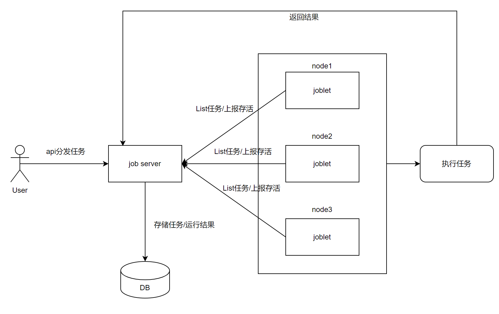

# job

## 项目描述

job项目是一个中心化任务分发执行服务，基于CS架构

### job server

中心服务，负责接收用户分发的任务，任务/结果的存储

### joblet

运行在节点上，启动时自动注册节点信息到job server，定时从job server获取当前节点的任务并执行，执行完成后将结果推送回job server

定时获取任务成功后，server会判定该节点存活

## 架构

## 使用方法